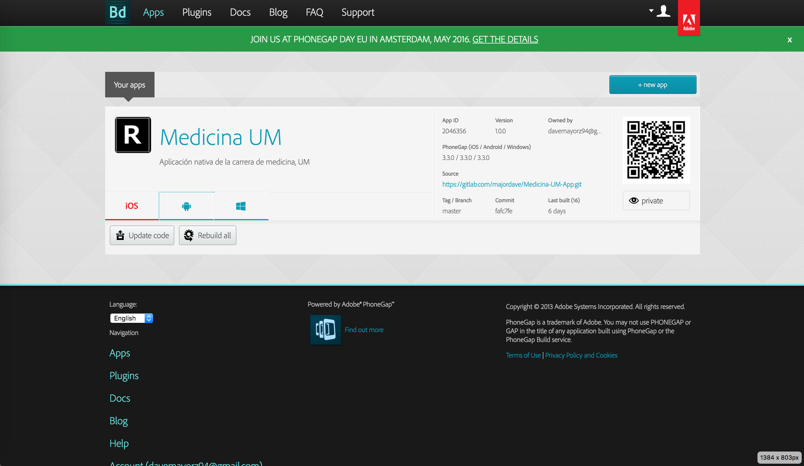

# Medicina-UM-App

Generación de aplicación nativa para Android, basada en la página de la Carrera de Medicina de la Universidad de Montemorelos:

[http://www.medicina-um.16mb.com](http://www.medicina-um.16mb.com)

## Recursos Utilizados

* WordPress
* Phonegap
* Administrador de Repositorios Git (GitHub/GitLab/Bitbucket)

## Procedimiento Seguido

### 1. Diseño de Página

Para el correcto funcionamiento de la aplicación es necesario asegurarse de utilizar un tema responsivo, compatible con lo último en recursos de desarrollo web móvil, tales como JavaScript y jQuery Mobile. Es por ello que se utilizó WordPress como plataforma, ya que cuenta con una gran variedad de temas de este tipo, así como plugins que hacen del proceso de desarrollo algo mucho más práctico.

### 2. Creación del Proyecto

Phonegap extrae el código de cada uno de sus builds de repositorios git como este, permitiendo agilizar el deployment. Los builds de Phonegap tienen una estructura definida que puede verse en su documentación.

En este caso, para hacerlo aún más sencillo, se utilizó el siguiente repositorio como template.

[https://github.com/pommiegranit/wp-barebones-mobileapp](https://github.com/pommiegranit/wp-barebones-mobileapp)

### 3. Cargando Íconos

Se sustituyó el ícono principal en las carpetas de recursos, cabe recalcar que en este caso el proyecto generado mantiene el ícono default, dado que se requieren las llaves de una cuenta de desarrollador Android para generar el proyecto completo, listo para subirlo a la Google Play Store.

En caso de concretarse, el ícono de la aplicación sería este:


### 4. Configurando la Aplicación

Toda la configuración necesaria está contenida en el archivo *config.xml*. En este caso se realizaron los siguientes cambios:

```html
<widget id="com.medicina_um.app"
```

Es el ID de la app generada, el estándar es invertir el dominio del sitio y añadirle *app* al final.

```html
<name>Medicina UM</name>
```

El título del sitio.

```html
<description>Aplicación nativa de la carrera de medicina, UM</description>
```

Una breve descripción del sitio.

```html
<author email="davemayorz94@gmail.com" href="#">Creador de la App</author>
```

Datos del autor.

```html
<content src="http://www.medicina-um.16mb.com" />
```

Como fuente del contenido, se introduce la Homepage del sitio.

### 5. Generación de la Aplicación

Una vez que se ha configurado la aplicación, puede dar inicio el proceso de build a través de Phonegap. Para ello entramos a la siguiente página:

[https://build.phonegap.com/apps](https://build.phonegap.com/apps)

Allí, podremos crear una nueva aplicación, seleccionar el repositorio deseado y dar inicio a la generación de la app.



Una vez generada, podrán descargarse los paquetes necesarios para su instalación desde la misma página, o mediante el código QR que aparece en la misma.

Dicho apk puede descargarse además desde la sección *tags* de este repositorio.

### 6. Mantenimiento de la Aplicación

En caso ser necesario actualizar la app, solo es necesario repetir el mismo proceso:

1. Modificar los archivos y actualizar el repositorio.
2. Actualizar el código en Phonegap.
3. Instalar el nuevo paquete generado.
